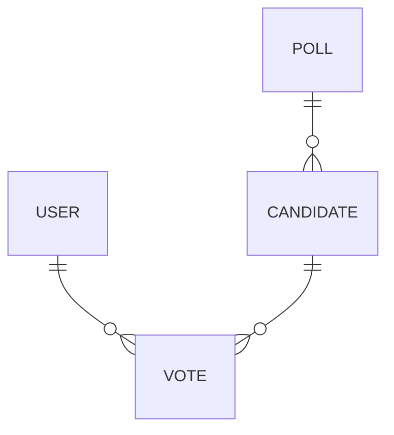

# Entity Relationship Diagram

This diagram shows the relationships represented in the sample database tables provided in this Rails Application.

[Diagram viewer](https://mermaid.live/edit#pako:eNp1jr0OgzAMhF8l8gwvkA01DJVQqUrbKYtFzI9ECEqToQq8e5MK1Kn25LvvdA7QGkXAgawYsbeo5cziPJryxtY1z01gz_peMs4kxP2ap-IizqKI6j_iWlfVYf7og4AMNFmNo4rFISUkuIE0SUiIog795BK5RRS9M817boE76ykDa3w_AO9wesXLLwod7b_v6vYBO5xBtg)

USER
* name:string
* email:string
* timestamps

VOTE
* user_id:foreign_key
* candidate_id:foreign_key
* timestamps

POLL
* candidate_id:foreign_key
* name:string
* timestamps

CANDIDATE
* name:string
* poll:foreign_key
* timestamps
